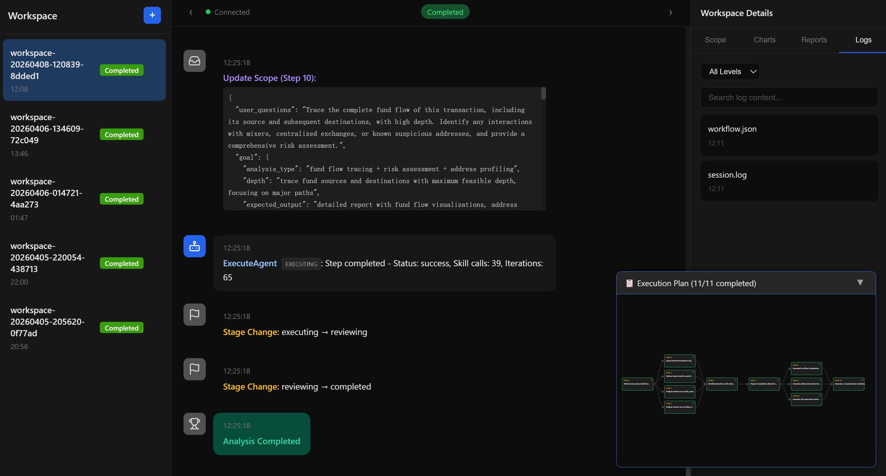
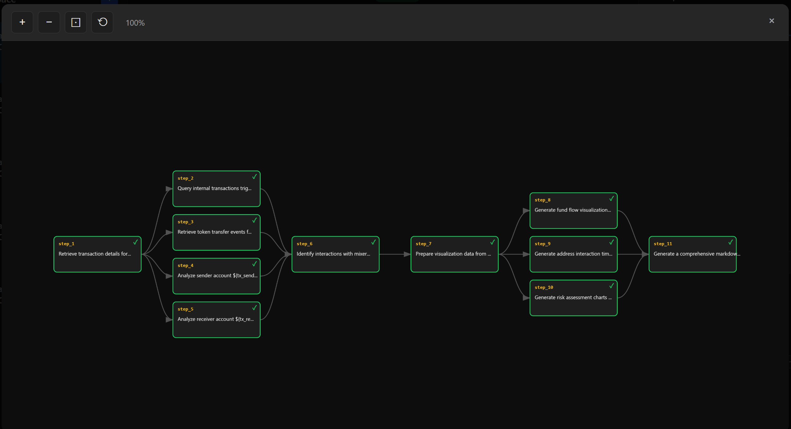
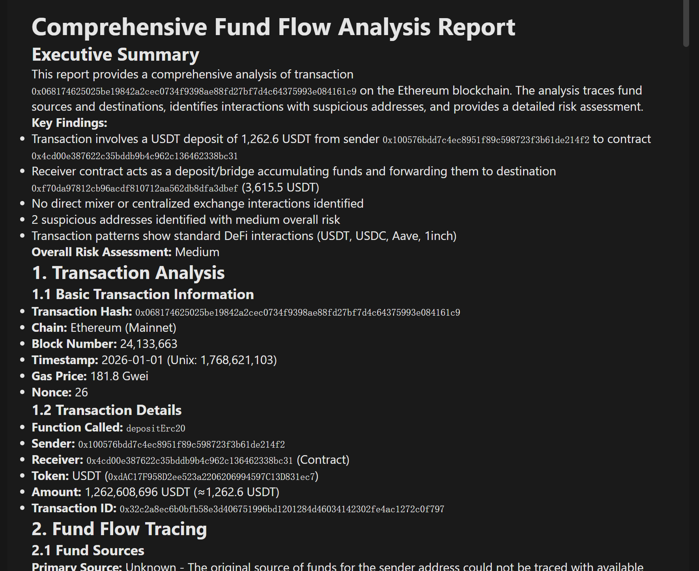

<div align="center">

# 🕵️‍♂️ Sherblock

**区块链交易行为分析智能体 - 像福尔摩斯一样侦察区块链数据**

*Sherlock + Block = Sherblock：揭开区块链交易中隐藏的模式和洞察*

[](https://opensource.org/licenses/MIT)
[](https://nodejs.org/)
[](https://developer.mozilla.org/zh-CN/docs/Web/JavaScript)

[English](README.md) | [中文](README-zh.md)

</div>

## 📋 项目简介

Sherblock 是一个先进的多智能体系统，专为智能区块链交易和地址行为分析而设计。基于"规划-执行"架构构建，它将大语言模型（LLM）的强大能力与专业的区块链分析技能相结合，实现复杂调查工作流的自动化。

无论您是在追踪资金流向、分析智能合约交互、分析钱包地址画像，还是在调查可疑活动，Sherblock 都可以作为您的AI驱动区块链侦探，处理数据收集、分析和报告的繁重工作。

## ✨ 核心特性

- **🤖 多智能体协作**：三个专业智能体协同工作：
  - 问题智能体（QuestionAgent）：使用 ReAct 模式进行交互式需求收集
  - 规划智能体（PlanAgent）：由深度推理模型驱动的战略规划
  - 执行智能体（ExecuteAgent）：使用区块链分析技能逐步执行

- **⚡ 并行执行引擎**：基于有向无环图（DAG）的任务调度，支持并发执行，大幅提升复杂任务的分析速度

- **🛠️ 丰富的技能系统**：34+ 专业技能，覆盖区块链数据分析的各个方面：
  - 账户、合约、交易、代币查询
  - 区块、Gas、日志、统计、地址标签信息
  - 图表生成和自动化报告撰写

- **📊 可视化与报告**：内置支持生成各种图表类型（折线图、柱状图、饼图、散点图、雷达图）和结构化 Markdown 分析报告

- **🌐 多链支持**：支持 13+ 主流区块链网络，包括以太坊、BSC、Polygon、Arbitrum、Optimism、Base 等

- **🎯 智能上下文管理**：针对长时间运行的复杂分析任务的自适应上下文压缩，防止上下文溢出

- **🖥️ 双交互界面**：同时提供基于 Web 的实时监控仪表板和 CLI 交互模式

- **🔄 状态机工作流**：完整的 6 阶段工作流管理（空闲 → 信息收集 → 规划 → 执行 → 审查 → 完成）

## 🏗️ 系统架构

```
┌─────────────────────┐    ┌─────────────────────┐    ┌─────────────────────┐
│   问题智能体        │───▶│    规划智能体        │───▶│   执行智能体        │
│  (需求收集)         │    │  (计划生成与审查)    │    │  (带技能的步骤执行) │
└─────────────────────┘    └─────────────────────┘    └─────────────────────┘
          │                        │                        │
          └────────────────────────┴────────────────────────┘
                               │
                               ▼
┌───────────────────────────────────────────────────────────┐
│                   智能体编排器                            │
│  (工作流协调、状态管理、事件总线)                         │
└───────────────────────────────────────────────────────────┘
                               │
                               ▼
┌─────────────────────┐    ┌─────────────────────┐    ┌─────────────────────┐
│  并行执行引擎        │    │   上下文管理器       │    │  工作区管理器        │
│  (DAG 调度)         │    │  (状态管理)          │    │  (隔离存储)          │
└─────────────────────┘    └─────────────────────┘    └─────────────────────┘
                               │
                               ▼
┌───────────────────────────────────────────────────────────┐
│                    技能注册表                              │
│  (34+ 区块链数据获取与分析技能)                           │
└───────────────────────────────────────────────────────────┘
                               │
                               ▼
┌─────────────────────┐    ┌─────────────────────┐    ┌─────────────────────┐
│   Etherscan API     │    │   大语言模型提供商   │    │  可视化库            │
│  (区块链数据)        │    │  (DeepSeek)         │    │  (Vega, Canvas)     │
└─────────────────────┘    └─────────────────────┘    └─────────────────────┘
```

### 核心组件

| 组件 | 职责 |
|-----------|----------------|
| **智能体编排器（AgentOrchestrator）** | 中央协调器，管理工作流状态转换和事件分发 |
| **问题智能体（QuestionAgent）** | 交互式信息收集，理解用户分析需求 |
| **规划智能体（PlanAgent）** | 生成结构化分析计划并审查执行结果 |
| **执行智能体（ExecuteAgent）** | 使用 ReAct 模式和区块链技能执行单个计划步骤 |
| **DAG 构建器（DAGBuilder）** | 从计划步骤构建有向无环图以支持并行执行 |
| **并行执行器（ParallelExecutor）** | 带依赖解析的并发任务执行 |
| **技能注册表（SkillRegistry）** | 动态加载和管理 34+ 专业区块链分析技能 |
| **上下文协调器（ScopeCoordinator）** | 并行执行的线程安全上下文状态管理 |
| **工作区管理器（WorkspaceManager）** | 为每个任务创建隔离工作区，存储日志、图表和报告 |

## 🔧 前置要求

- Node.js 16.0+
- npm 或 yarn 包管理器
- Windows 10+/macOS 10.15+/Linux
- API 密钥：
  - DeepSeek
  - Etherscan

## 📦 安装步骤

1. **克隆仓库**
   ```bash
   git clone https://github.com/scriptLin-bjtu/Sherblock.git
   cd sherblock
   ```

2. **安装依赖**
   ```bash
   # 安装后端依赖
   npm install
   
   # 安装前端依赖
   cd frontend && npm install && cd ..
   ```

3. **配置环境变量**
   ```bash
   # 复制示例环境文件
   cp .env.example .env
   ```
   
   编辑 `.env` 文件，填入您的 API 密钥：
   ```env
   # 必需的 API 密钥
   DEEPSEEK_API_KEY=您的_deepseek_api_key
   ETHERSCAN_API_KEY=您的_etherscan_api_key
   
   # 可选配置
   MAX_PARALLEL_TASKS=3
   USE_PARALLEL_EXECUTION=true
   CONTINUE_ON_FAILURE=false
   HTTP_PROXY=http://127.0.0.1:7890
   ```

## 🚀 使用方法

### Web 界面模式（推荐）

1. **启动完整开发环境**
   ```bash
   npm run dev
   ```

2. **打开浏览器**，访问 `http://localhost:5173`

3. **在输入框中输入您的分析请求**，实时查看分析过程

4. **查看结果**，包括生成的报告、图表和分析发现

### CLI 模式

1. **并行执行模式（默认）**
   ```bash
   npm start
   ```

2. **串行执行模式**
   ```bash
   node src/index.js
   ```

3. **自定义并行执行**
   ```bash
   # 自定义最大并行任务数
   npm start -- --parallel --max-parallel 5
   
   # 禁用审查步骤，加快执行速度
   npm start -- --no-review
   ```

4. **查看帮助**
   ```bash
   node src/index.js --help
   ```

## 📸 截图展示

> 📝 **注意：** 请将这些替换为您应用的实际截图

### Web 仪表板

*实时分析监控仪表板，展示任务进度和结果*

### DAG 并行执行视图

*带依赖图的并行任务执行可视化*

### 生成的分析报告

*自动生成的 Markdown 报告，包含图表和发现*

## ⚙️ 配置说明

### 必需的 API 密钥

| API 密钥 | 用途 | 获取地址 |
|---------|---------|--------------|
| `DEEPSEEK_API_KEY` | 用于推理和执行的 DeepSeek 模型 | [DeepSeek 平台](https://platform.deepseek.com/) |
| `ETHERSCAN_API_KEY` | 区块链数据获取 | [Etherscan APIs](https://etherscan.io/apis) |

### 可选环境变量

| 变量 | 默认值 | 描述 |
|----------|---------|-------------|
| `MAX_PARALLEL_TASKS` | `3` | 最大并行执行任务数 |
| `USE_PARALLEL_EXECUTION` | `true` | 启用/禁用并行执行模式 |
| `CONTINUE_ON_FAILURE` | `false` | 即使某些任务失败也继续执行 |
| `HTTP_PORT` | `3000` | HTTP 服务器端口 |
| `WS_PORT` | `8080` | WebSocket 服务器端口 |
| `HTTP_PROXY` | `http://127.0.0.1:7890` | API 请求的代理服务器 |
| `API_TIMEOUT` | `30000` | API 请求超时时间（毫秒） |

## 📚 支持的链和技能

### 支持的区块链网络

#### 主网
- 以太坊 (1)
- Polygon (137)
- BSC (56)
- Arbitrum (42161)
- Optimism (10)
- Base (8453)
- Avalanche (43114)
- Linea (59144)
- Blast (81457)
- Scroll (534352)
- Gnosis (100)
- Celo (42220)
- Moonbeam (1284)

#### 测试网
- Sepolia (11155111)
- Polygon Amoy (80002)

### 技能类别

1. **账户**：余额查询、交易历史、内部交易、资金来源追踪
2. **合约**：ABI 获取、源代码查询、合约创建者信息
3. **交易**：交易状态、收据详情、按哈希查询内部交易
4. **代币**：ERC20/ERC721/ERC1155 转账、代币信息、余额查询
5. **区块**：按编号/哈希查询区块详情、基于时间戳的区块查找
6. **Gas**：Gas 价格估算、Gas 使用统计
7. **日志**：智能合约事件日志查询
8. **统计**：ETH 价格、网络供应量、区块奖励统计
9. **地址标签**：地址标记和身份信息
10. **代理**：直接 ETH RPC 调用，用于高级查询
11. **可视化**：图表生成（折线图、柱状图、饼图、散点图、雷达图）
12. **报告**：自动化 Markdown 报告生成

## 🛠️ 开发指南

### 可用脚本

```bash
# 启动完整开发环境（服务器 + 前端）
npm run dev

# 仅启动后端 HTTP + WebSocket 服务器
npm run server

# 仅启动前端开发服务器
npm run dev:frontend

# 运行 CLI 模式（并行执行）
npm start

# 运行单元测试
npm run test:unit

# 监听模式运行测试
npm run test:watch

# 生成测试覆盖率报告
npm run test:coverage
```

### 项目结构

```
sherblock/
├── src/
│   ├── agents/              # 智能体实现
│   │   ├── questionBot/     # 问题智能体（需求收集）
│   │   ├── planBot/         # 规划智能体（规划与审查）
│   │   ├── executeBot/      # 执行智能体（步骤执行）
│   │   │   └── skills/      # 34+ 区块链分析技能
│   │   └── orchestrator/    # 智能体编排器（工作流协调）
│   ├── services/            # 外部服务（LLM 等）
│   ├── server/              # HTTP 和 WebSocket 服务器
│   ├── utils/               # 工具函数
│   ├── index.js             # CLI 入口点
│   └── server-index.js      # 服务器入口点
├── frontend/                # 原生 JavaScript Web 界面
├── docs/                    # 文档
├── data/                    # 工作区存储（git 忽略）
├── .env.example             # 环境变量模板
└── package.json             # 项目依赖
```

## 🤝 贡献指南

我们欢迎社区贡献！以下是您可以参与的方式：

1. **Fork 仓库**并创建您的功能分支：`git checkout -b feature/amazing-feature`
2. **进行修改**：添加新技能、修复 bug、改进文档或增强现有功能
3. **测试您的修改**：运行现有测试并为新功能添加测试
4. **提交修改**：`git commit -m '添加某个很棒的功能'`
5. **推送到分支**：`git push origin feature/amazing-feature`
6. **提交 Pull Request**：我会审查您的修改，如果符合项目目标会合并

### 贡献规范

- 遵循现有的代码风格和约定
- 为复杂逻辑添加适当的注释
- 为任何更改的功能更新文档
- 提交 PR 前确保所有测试通过
- 保持 PR 专注于单个功能或 bug 修复

## ❓ 常见问题

### 问：支持哪些 LLM 模型？
答：目前我完全基于 DeepSeek 模型构建：使用 DeepSeek Chat 处理一般任务，使用 DeepSeek Reasoner 进行复杂规划和审查。

### 问：我可以添加更多区块链网络的支持吗？
答：可以！技能系统设计为可扩展的。您可以通过更新 Etherscan 客户端配置来添加对新网络的支持。

### 问：如何添加新的分析技能？
答：按照现有技能模式，在 `src/agents/executeBot/skills/[category]/[skill-name]/` 中创建新的技能模块，它会被自动加载。

### 问：Etherscan API 调用有速率限制吗？
答：是的，免费的 Etherscan API 密钥速率限制为 5 次/秒。系统内置了速率限制和重试机制。

### 问：我可以将其用于商业目的吗？
答：可以！Sherblock 采用 MIT 许可证发布，允许商业使用、修改和分发。

### 问：未来会支持更多大语言模型提供商吗？
答：是的！目前我完全基于 DeepSeek 模型构建，但计划在未来版本中添加对多种大语言模型提供商的支持（包括 OpenAI、Anthropic Claude、Google Gemini 等），允许用户通过 API 密钥配置选择自己偏好的模型提供商。

## 🤝 联系方式与合作

如果您有兴趣参与本项目的开发、有功能需求或者想讨论任何想法，欢迎随时联系我：

- 📧 邮箱：[p1091451463@gmail.com](mailto:p1091451463@gmail.com)

我非常欢迎各种合作和贡献，一起构建更好的 Sherblock！

## 📄 许可证

本项目采用 MIT 许可证 - 查看 [LICENSE](LICENSE) 文件了解详情。


---

<div align="center">
由 scriptLin 用 ❤️ 打造
</div>
